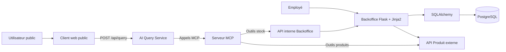
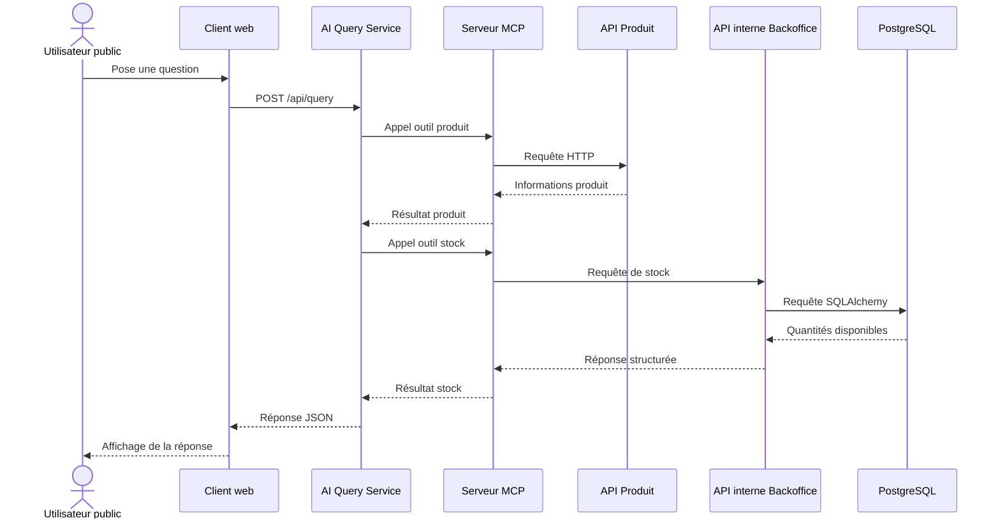

# Architecture de HBntory

## 1. Présentation

HBntory est une plateforme de gestion de stock composée de plusieurs
services indépendants.

Le système possède deux interfaces principales :

- un Backoffice interne réservé aux employés authentifiés ;
- un client web public permettant de poser des questions sur les produits
  et leur disponibilité.

Le projet utilise une architecture multi-services afin de séparer les
responsabilités liées aux utilisateurs, aux stocks, aux produits et à
l’intelligence artificielle.

---

## 2. Objectifs de l’architecture

L’architecture doit permettre de :

- gérer les utilisateurs et les branches ;
- sécuriser l’accès au Backoffice ;
- gérer les quantités de stock ;
- consulter les produits depuis une API externe ;
- fournir des outils MCP à un agent IA ;
- répondre à des questions en langage naturel ;
- conserver des frontières claires entre les services ;
- lancer le système avec Docker Compose.

---

## 3. Principes principaux

### 3.1 Séparation des responsabilités

Chaque composant possède une responsabilité précise.

Le Backoffice ne contient pas la logique de l’agent IA.

Le service AI Query ne gère pas directement les utilisateurs ou les
stocks.

Le serveur MCP fournit uniquement des outils contrôlés permettant à
l’agent de consulter les données nécessaires.

### 3.2 Source unique des produits

L’API Produit externe est la source officielle des données produit.

La base de données HBntory ne stocke jamais :

- le nom d’un produit ;
- sa description ;
- son prix ;
- sa catégorie ;
- sa marque ;
- son fournisseur ;
- son image ;
- ses métadonnées.

La base locale conserve uniquement l’identifiant externe du produit dans
les lignes de stock.

### 3.3 Contrôle des autorisations côté backend

Les autorisations sont toujours vérifiées par le Backoffice.

Cacher un bouton dans l’interface ne constitue pas une protection
suffisante.

Le backend vérifie notamment :

- que l’utilisateur est connecté ;
- que son compte est actif ;
- que son rôle autorise l’action ;
- qu’un common user agit uniquement sur sa branche.

### 3.4 Aucun accès direct de l’agent à PostgreSQL

L’agent IA ne peut pas exécuter de requêtes SQL libres.

Il utilise uniquement les outils exposés par le serveur MCP.

Pour les stocks, le MCP communique avec une API interne en lecture seule
exposée par le Backoffice.

---

## 4. Composants du système

### 4.1 Backoffice

Le Backoffice est une application Flask utilisant un rendu côté serveur
avec Jinja2.

Il est responsable de :

- l’authentification ;
- la gestion des sessions ;
- la gestion des utilisateurs ;
- la gestion des branches ;
- la gestion des stocks ;
- la vérification des rôles ;
- la vérification des branches ;
- l’accès à PostgreSQL avec SQLAlchemy ;
- l’exposition d’une API interne de consultation des stocks.

Deux rôles sont disponibles :

#### Administrateur

L’administrateur peut :

- lister les common users ;
- créer un common user ;
- modifier sa branche ;
- modifier son mot de passe ;
- désactiver son compte avec un soft-delete.

L’administrateur ne peut pas gérer les stocks.

#### Common user

Un common user appartient à une seule branche.

Il peut uniquement :

- consulter le stock de sa branche ;
- ajouter du stock dans sa branche ;
- retirer du stock dans sa branche ;
- consulter la quantité d’un produit.

Il ne peut pas gérer les utilisateurs ni agir sur une autre branche.

---

### 4.2 Base de données PostgreSQL

PostgreSQL stocke uniquement les données internes de HBntory.

Les principales entités sont :

- `User` ;
- `Branch` ;
- `Stock`.

SQLAlchemy est utilisé comme ORM pour définir les modèles, les relations
et les contraintes.

La base contient notamment :

```text
User
├── id
├── username
├── password_hash
├── role
├── is_active
└── branch_id

Branch
├── id
└── name

Stock
├── id
├── branch_id
├── product_id
└── quantity
```

Les règles principales sont :

- une quantité de stock ne peut pas être négative ;
- la combinaison `branch_id` et `product_id` doit être unique ;
- un common user doit appartenir à une branche ;
- un utilisateur désactivé reste présent dans la base ;
- aucune donnée descriptive de produit n’est enregistrée localement.

---

### 4.3 API Produit externe

L’API Produit est une dépendance externe en lecture seule.

Elle fournit les données descriptives des produits, par exemple :

- identifiant ;
- SKU ;
- nom ;
- description ;
- catégorie ;
- prix ;
- fournisseur ;
- état du produit.

Le Backoffice et le serveur MCP communiquent avec cette API par HTTP.

Le système doit gérer :

- les produits inexistants ;
- les erreurs HTTP ;
- les délais de réponse ;
- l’indisponibilité du service ;
- les réponses inattendues.

---

### 4.4 Serveur MCP

Le serveur MCP sert de pont entre l’agent IA et les sources de données.

Il fournit deux catégories d’outils.

#### Outils produits

```text
list_products()
get_product_details(product_id)
```

Ces outils interrogent l’API Produit externe.

#### Outils de stock

```text
get_stock_by_product(product_id)
get_stock_by_branch(branch_id)
check_shopping_list(items)
```

Ces outils interrogent l’API interne du Backoffice.

Le serveur MCP :

- valide les paramètres reçus ;
- appelle le service approprié ;
- transforme les réponses ;
- gère les erreurs ;
- retourne des données structurées à l’agent.

---

### 4.5 Service AI Query

Le service AI Query est indépendant du Backoffice.

Il est responsable de :

- recevoir les questions du client public ;
- comprendre l’intention de l’utilisateur ;
- choisir les outils MCP nécessaires ;
- utiliser les résultats des outils ;
- générer une réponse compréhensible ;
- refuser d’inventer une information manquante.

Le service doit répondre au minimum aux questions suivantes :

- obtenir les détails d’un produit ;
- trouver les branches possédant un produit ;
- lister les produits disponibles dans une branche ;
- trouver les branches capables de satisfaire une liste d’achats.

Lorsque les outils ne fournissent pas suffisamment d’informations,
le service doit le signaler clairement.

---

### 4.6 Client web public

Le client web public est accessible sans authentification.

Il contient :

- un champ de question ;
- un bouton d’envoi ;
- un indicateur de chargement ;
- une zone de réponse ;
- une gestion simple des erreurs.

Il communique avec le service AI Query par REST.

Chaque question est indépendante et aucun historique de conversation
n’est conservé dans le MVP.

---

## 5. Diagramme général



---

## 6. Propriété des données

| Donnée | Service responsable |
|---|---|
| Utilisateurs | Backoffice / PostgreSQL |
| Rôles | Backoffice / PostgreSQL |
| Branches | Backoffice / PostgreSQL |
| Quantités de stock | Backoffice / PostgreSQL |
| Identifiants produit associés au stock | Backoffice / PostgreSQL |
| Nom et description des produits | API Produit externe |
| Prix et catégorie des produits | API Produit externe |
| Questions publiques | AI Query Service |
| Réponses publiques | AI Query Service |

Le service AI Query et le serveur MCP ne deviennent jamais propriétaires
des données produit ou des données de stock.

---

## 7. Communications entre les services

| Source | Destination | Protocole | Utilité |
|---|---|---|---|
| Navigateur interne | Backoffice | HTTP | Pages et formulaires |
| Backoffice | PostgreSQL | SQLAlchemy | Données internes |
| Backoffice | API Produit | HTTP | Validation et affichage des produits |
| Client public | AI Query Service | REST | Questions publiques |
| AI Query Service | Serveur MCP | MCP | Appel des outils |
| Serveur MCP | API Produit | HTTP | Informations produit |
| Serveur MCP | API interne Backoffice | HTTP | Informations de stock |

Les services ne réalisent aucun import direct depuis le code d’un autre
service.

---

## 8. Parcours Backoffice

### 8.1 Connexion

```text
1. L’utilisateur ouvre le formulaire de connexion.
2. Il saisit son identifiant et son mot de passe.
3. Le Backoffice recherche son compte dans PostgreSQL.
4. Le système vérifie que le compte est actif.
5. bcrypt vérifie le mot de passe.
6. Flask-Login crée la session.
7. L’utilisateur est redirigé selon son rôle.
```

### 8.2 Ajout de stock

```text
1. Le common user ouvre le formulaire de stock.
2. Le Backoffice vérifie sa session.
3. Le Backoffice vérifie son rôle.
4. La branche est obtenue depuis le compte connecté.
5. Le produit est vérifié avec l’API Produit.
6. La quantité est validée.
7. SQLAlchemy met à jour le stock.
8. La page mise à jour est affichée.
```

### 8.3 Retrait de stock

Le retrait est refusé lorsque :

- la quantité demandée est inférieure ou égale à zéro ;
- la quantité n’est pas un entier ;
- le produit n’existe pas ;
- le stock disponible est insuffisant ;
- l’utilisateur tente d’agir sur une autre branche.

---

## 9. Parcours public

Exemple de question :

```text
Dans quelle branche le produit 12 est-il disponible ?
```

Parcours :

```text
1. Le client web envoie la question au service AI Query.
2. Le service IA identifie le produit demandé.
3. L’agent appelle l’outil MCP de détail produit.
4. Le MCP interroge l’API Produit externe.
5. L’agent appelle l’outil MCP de recherche de stock.
6. Le MCP interroge l’API interne du Backoffice.
7. Le Backoffice consulte PostgreSQL.
8. Les résultats sont retournés à l’agent.
9. L’agent formule une réponse basée sur les données.
10. Le client web affiche la réponse.
```

Diagramme :



---

## 10. Sécurité

### 10.1 Mots de passe

Les mots de passe sont hachés avec bcrypt.

La base ne stocke jamais les mots de passe en clair.

### 10.2 Sessions

Flask-Login gère :

- la connexion ;
- la déconnexion ;
- l’utilisateur courant ;
- la protection des routes.

La clé secrète Flask est fournie par une variable d’environnement.

### 10.3 Autorisations

Les autorisations sont vérifiées côté serveur.

Chaque requête protégée vérifie :

- la session ;
- le statut actif ;
- le rôle ;
- la branche lorsque cela est nécessaire.

### 10.4 Variables d’environnement

Le fichier `.env` contient les valeurs locales et les secrets.

Il n’est jamais versionné.

Le fichier `.env.example` contient uniquement les noms des variables et
des valeurs fictives.

---

## 11. Déploiement local

Le projet est organisé en monorepo multi-services.

Docker Compose permettra de lancer les principaux composants :

```text
docker-compose.yml
├── PostgreSQL
├── Backoffice
├── API Produit externe
├── Serveur MCP
├── AI Query Service
└── Client web public
```

Chaque service possède :

- son propre dossier ;
- ses propres dépendances ;
- ses propres tests ;
- son propre Dockerfile.

---

## 12. Structure du dépôt

```text
hbntory/
├── backoffice/
├── product_mcp_server/
├── ai_service/
├── client_web/
├── docs/
│   ├── architecture.md
│   └── adr/
├── docker-compose.yml
├── .env.example
├── .gitignore
└── README.md
```

---

## 13. Produit minimum viable

Le MVP doit inclure :

### Backoffice

- connexion et déconnexion ;
- administrateur initial ;
- création et modification des common users ;
- attribution d’une branche ;
- soft-delete ;
- consultation du stock ;
- ajout et retrait du stock ;
- contrôle des rôles côté backend.

### Serveur MCP

- liste des produits ;
- détails d’un produit ;
- consultation des stocks par produit ;
- consultation des stocks par branche ;
- vérification d’une liste d’achats.

### Service AI Query

- détails d’un produit ;
- branches possédant un produit ;
- produits disponibles dans une branche ;
- vérification d’une liste d’achats ;
- refus d’inventer des informations absentes.

### Client web

- saisie d’une question ;
- envoi REST ;
- affichage du chargement ;
- affichage de la réponse ;
- gestion des erreurs.

---

## 14. Fonctionnalités hors MVP

Les fonctionnalités suivantes ne sont pas prioritaires :

- historique de conversation ;
- streaming des réponses ;
- WebSocket ;
- notifications ;
- statistiques avancées ;
- plusieurs administrateurs ;
- interface graphique complexe ;
- modification des produits externes.

---

## 15. Références aux ADR

Les décisions détaillées sont documentées dans :

- `ADR 0001` : REST pour le client public ;
- `ADR 0002` : rendu côté serveur pour le Backoffice ;
- `ADR 0003` : serveur MCP personnalisé pour les stocks ;
- `ADR 0004` : bcrypt et sessions Flask ;
- `ADR 0005` : monorepo multi-services.