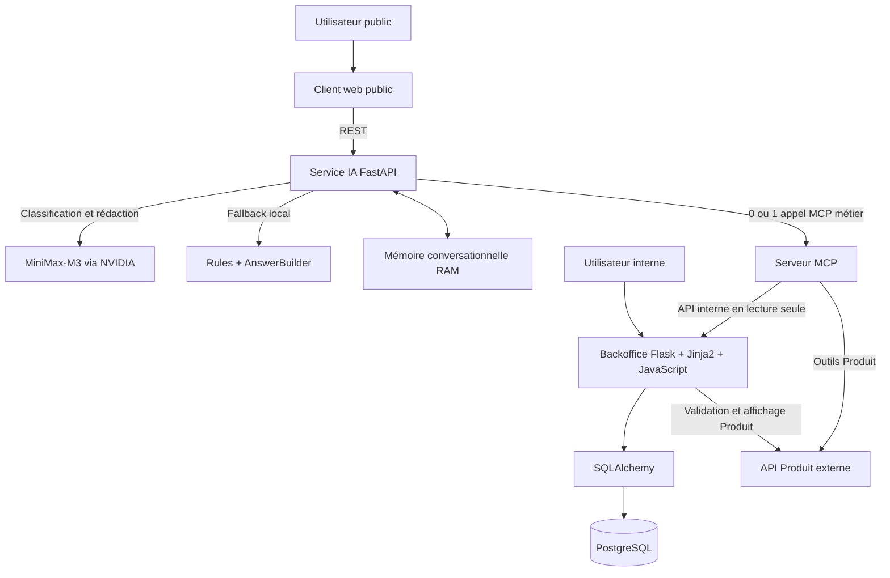

# Architecture de HBntory

## 1. Présentation

HBntory est une plateforme de gestion de stock multi-branches organisée en
plusieurs services indépendants.

Le système possède deux interfaces principales :

- un Backoffice interne réservé aux utilisateurs authentifiés ;
- un client web public permettant de consulter les produits et les stocks en
  langage naturel.

L’architecture sépare clairement :

- les utilisateurs et les autorisations ;
- les données de stock ;
- les informations descriptives des produits ;
- l’accès contrôlé aux données par MCP ;
- le traitement des questions par le service IA ;
- l’interface publique.

---

## 2. Objectifs de l’architecture

L’architecture doit permettre de :

- gérer les utilisateurs internes et leur branche ;
- sécuriser l’accès au Backoffice ;
- consulter, ajouter et retirer du stock ;
- obtenir les informations Produit depuis l’API externe ;
- exposer des outils MCP strictement contrôlés ;
- répondre à des questions en langage naturel ;
- empêcher l’IA d’accéder directement à PostgreSQL ;
- conserver des frontières réseau claires entre les services ;
- lancer l’ensemble du système avec Docker Compose.

---

## 3. Principes d’architecture

### 3.1 Séparation des responsabilités

Chaque composant possède une responsabilité précise :

- le Backoffice gère les utilisateurs, les rôles et les stocks ;
- PostgreSQL stocke uniquement les données locales ;
- l’API Produit fournit les informations descriptives des produits ;
- le serveur MCP expose des outils de lecture contrôlés ;
- le service IA comprend les questions et orchestre les appels MCP ;
- le client web public communique uniquement avec le service IA.

Les services ne réalisent aucun import direct depuis le code métier d’un autre
service. Ils communiquent par HTTP, REST ou MCP.

### 3.2 Source unique des produits

L’API Produit externe est la source de vérité pour les informations Produit.

PostgreSQL ne stocke jamais :

- le nom d’un produit ;
- sa description ;
- son prix ;
- son image ;
- sa catégorie ;
- sa marque ;
- son fournisseur ;
- ses métadonnées.

La base locale conserve uniquement l’identifiant externe nécessaire pour
associer une quantité de stock à un produit.

### 3.3 Autorisations contrôlées par le backend

Les autorisations sont toujours vérifiées côté serveur.

Masquer un bouton dans l’interface ne constitue pas une protection suffisante.

Le Backoffice vérifie notamment :

- que l’utilisateur est authentifié ;
- que son compte est actif ;
- que son rôle autorise l’action ;
- qu’un common user agit uniquement sur sa branche ;
- qu’un administrateur n’effectue aucune opération de stock.

### 3.4 Aucun accès direct de l’IA à PostgreSQL

Le service IA n’exécute aucune requête SQL et n’accède directement ni au
Backoffice, ni à PostgreSQL, ni à l’API Produit.

Toutes les données métier utilisées par le service IA passent par le serveur
MCP.

Pour les stocks, le MCP appelle une API interne en lecture seule exposée par le
Backoffice.

---

## 4. Composants du système

### 4.1 Backoffice

Le Backoffice est une application Flask utilisant principalement un rendu côté
serveur avec Jinja2.

Du JavaScript est utilisé pour certaines interactions, notamment les mouvements
de stock, mais Flask reste l’autorité unique pour :

- l’authentification ;
- les sessions ;
- la protection CSRF ;
- les autorisations ;
- la validation métier ;
- les transactions ;
- l’accès à PostgreSQL avec SQLAlchemy.

Le Backoffice est responsable :

- de la connexion et de la déconnexion ;
- de la gestion des common users ;
- de leur affectation à une branche ;
- de leur désactivation et de leur réactivation ;
- de la consultation du stock ;
- de l’ajout et du retrait du stock ;
- de la validation des produits auprès de l’API Produit ;
- de l’exposition d’une API interne de consultation des stocks.

Le Backoffice ne fournit pas de CRUD complet pour les branches. Les branches
sont initialisées par le système et utilisées pour l’affectation des
utilisateurs et des stocks.

#### Administrateur

L’administrateur peut :

- lister les common users ;
- créer un common user ;
- modifier son mot de passe ;
- modifier sa branche ;
- désactiver ou réactiver son compte.

L’administrateur ne peut pas gérer les stocks.

#### Common user

Un common user appartient exactement à une branche.

Il peut uniquement :

- consulter le stock de sa branche ;
- ajouter du stock dans sa branche ;
- retirer du stock dans sa branche ;
- consulter la quantité disponible pour un produit de sa branche.

Il ne peut pas gérer les utilisateurs ni agir sur une autre branche.

### 4.2 Base de données PostgreSQL

PostgreSQL stocke uniquement les données internes de HBntory.

```text
User
├── id
├── username
├── password_hash
├── role
├── is_active
└── branch_id

Branch
├── id
└── name

Stock
├── id
├── branch_id
├── product_id
└── quantity
```

Les règles principales sont :

- les rôles autorisés sont `admin` et `common` ;
- un administrateur ne possède aucune branche ;
- un common user doit appartenir à une branche ;
- un utilisateur désactivé reste présent dans la base ;
- une quantité de stock ne peut pas être négative ;
- la combinaison `(branch_id, product_id)` est unique ;
- les noms d’utilisateur et de branche sont uniques sans tenir compte de la
  casse ;
- aucune information descriptive de produit n’est enregistrée localement.

SQLAlchemy définit les modèles et les relations. Les migrations créent les
contraintes SQL nécessaires.

### 4.3 API Produit externe

L’API Produit est une dépendance en lecture seule.

Elle fournit notamment :

- l’identifiant ;
- le SKU ;
- le nom ;
- la description ;
- la catégorie ;
- la marque ;
- le fournisseur ;
- le prix ;
- la devise ;
- l’état du produit.

Le Backoffice et le serveur MCP communiquent avec cette API par HTTP.

Les clients doivent gérer :

- les produits inconnus ;
- les erreurs HTTP ;
- les délais d’attente ;
- l’indisponibilité du service ;
- les réponses mal formées ou inattendues.

### 4.4 Serveur MCP

Le serveur MCP sert de frontière contrôlée entre le service IA et les sources
de données.

Il utilise FastMCP avec un transport Streamable HTTP sur la route `/mcp`.

Il expose exactement cinq outils en lecture seule :

```text
list_products
get_product_details
get_stock_by_product
get_stock_by_branch
check_shopping_list
```

#### Outils Produit

```text
list_products(limit, offset)
get_product_details(product_id)
```

Ces outils interrogent l’API Produit externe.

#### Outils de stock

```text
get_stock_by_product(product_id)
get_stock_by_branch(branch_id | branch_name)
check_shopping_list(items)
```

Ces outils interrogent l’API interne du Backoffice.

`get_stock_by_branch` accepte exactement une référence :

- un `branch_id` strictement positif ;
- ou un `branch_name` non vide.

Lorsqu’un nom est fourni, le MCP utilise :

```http
GET /internal/stocks/branches/by-name?name=...
```

Pour enrichir le stock d’une branche, les identifiants et les quantités viennent
du Backoffice, puis le MCP récupère les noms et les prix officiels auprès de
l’API Produit.

Cette agrégation reste interne au même outil. Le service IA réalise toujours au
maximum un appel MCP métier par question.

Le serveur MCP :

- valide strictement les paramètres ;
- rejette les champs inconnus ;
- utilise des clients HTTP partagés ;
- applique des délais d’attente ;
- transforme les erreurs en réponses structurées ;
- ne se connecte jamais directement à PostgreSQL ;
- ne peut effectuer aucune écriture de stock.

### 4.5 Service IA

Le service IA est une application FastAPI indépendante du Backoffice.

Il est responsable :

- de recevoir les questions du client public ;
- de comprendre l’intention de l’utilisateur ;
- de résoudre les références conversationnelles autorisées ;
- de valider les paramètres avec Pydantic ;
- de sélectionner zéro ou un outil MCP ;
- de valider les données retournées par MCP ;
- de produire une réponse naturelle ;
- de refuser les demandes hors périmètre ou les demandes d’écriture ;
- de ne jamais inventer une donnée absente.

Les intentions prises en charge sont :

- `product_list` ;
- `product_details` ;
- `stock_by_product` ;
- `stock_by_branch` ;
- `shopping_list` ;
- `unsupported`.

#### Fournisseur IA

Deux modes sont acceptés :

```text
nvidia
rules
```

En mode `nvidia`, MiniMax-M3 est utilisé via l’API NVIDIA pour :

1. classifier la question ;
2. rédiger une réponse naturelle à partir des faits validés.

Le service effectue au maximum :

- deux appels NVIDIA par message ;
- un appel MCP métier par message.

Le modèle ne réalise aucun tool calling. L’orchestrateur Python choisit seul
l’outil MCP et ses arguments.

En mode `rules`, ou lorsque la clé NVIDIA est absente ou que le fournisseur est
indisponible :

- les règles locales comprennent les demandes simples ;
- `AnswerBuilder` produit une réponse déterministe.

#### Contrôle factuel

Les réponses générées sont contrôlées avant d’être envoyées au client.

Le système vérifie notamment les relations suivantes :

- produit et prix ;
- produit et devise ;
- produit et branche ;
- branche et quantité ;
- disponibilité et quantité ;
- résultat d’une liste d’achats.

Une réponse invalide ou contradictoire est remplacée par la réponse déterministe
d’`AnswerBuilder`.

#### Conversation multi-tour

La conversation multi-tour est une fonctionnalité optionnelle ajoutée au-delà
du minimum demandé.

`POST /api/query` accepte un `conversation_id` facultatif.

Le service conserve en RAM un état limité contenant notamment :

- le dernier intent ;
- le dernier produit ;
- la dernière branche ;
- la dernière liste de produits ;
- la dernière liste d’achats ;
- un historique réduit.

La mémoire :

- est séparée par conversation ;
- expire après une durée d’inactivité ;
- est limitée en nombre de tours et de sessions ;
- disparaît au redémarrage ;
- n’est pas une mémoire utilisateur persistante.

Elle permet de comprendre des formulations telles que :

```text
Et à Toulouse ?
Le deuxième.
Où puis-je le trouver ?
Cette branche.
```

#### Routes publiques

```http
GET /health
GET /ready
GET /api/products
POST /api/query
```

`GET /api/products` appelle directement l’outil MCP `list_products` et ne fait
aucun appel NVIDIA.

`GET /health` vérifie que le processus HTTP fonctionne.

`GET /ready` vérifie la connexion MCP et expose le fournisseur demandé, son
statut de configuration et le fournisseur réellement actif. Cette route ne
réalise pas un appel de génération au fournisseur.

### 4.6 Client web public

Le client web public est accessible sans authentification.

Il contient :

- un champ de question ;
- un bouton d’envoi ;
- un indicateur de chargement ;
- une zone de réponse ;
- une gestion des erreurs ;
- un catalogue de produits.

Il communique uniquement avec le service IA :

```http
GET /api/products
POST /api/query
```

Le client conserve uniquement le `conversation_id` dans `sessionStorage`.

Il ne contacte jamais directement :

- PostgreSQL ;
- le Backoffice ;
- l’API interne ;
- le serveur MCP ;
- l’API Produit.

---

## 5. Diagramme général



---

## 6. Propriété des données

| Donnée | Source de vérité |
|---|---|
| Utilisateurs | Backoffice / PostgreSQL |
| Rôles | Backoffice / PostgreSQL |
| Branches | Backoffice / PostgreSQL |
| Quantités de stock | Backoffice / PostgreSQL |
| Identifiants Produit associés au stock | Backoffice / PostgreSQL |
| Noms, descriptions et images Produit | API Produit externe |
| Prix, devises et métadonnées Produit | API Produit externe |
| Conversations courtes | Service IA, mémoire RAM volatile |

Le service IA et le serveur MCP ne deviennent jamais propriétaires des données
Produit ou des stocks.

---

## 7. Communications entre les services

| Source | Destination | Protocole | Utilité |
|---|---|---|---|
| Navigateur interne | Backoffice | HTTP | Pages, formulaires et mouvements de stock |
| Backoffice | PostgreSQL | SQLAlchemy | Données internes |
| Backoffice | API Produit | HTTP | Validation et affichage Produit |
| Client public | Service IA | REST | Catalogue et questions |
| Service IA | NVIDIA | HTTPS | Classification et rédaction |
| Service IA | Serveur MCP | MCP Streamable HTTP | Appel des outils |
| Serveur MCP | API Produit | HTTP | Informations Produit |
| Serveur MCP | API interne Backoffice | HTTP | Informations de stock |

---

## 8. Parcours Backoffice

### 8.1 Connexion

```text
1. L’utilisateur ouvre le formulaire de connexion.
2. Il saisit son identifiant et son mot de passe.
3. Le Backoffice recherche son compte dans PostgreSQL.
4. Le système vérifie que le compte est actif.
5. bcrypt vérifie le mot de passe.
6. Flask-Login crée la session.
7. L’utilisateur est redirigé selon son rôle.
```

### 8.2 Ajout de stock

```text
1. Le common user ouvre la page de sa branche.
2. Le Backoffice vérifie la session, le rôle et la branche.
3. Le produit est validé auprès de l’API Produit.
4. La quantité est validée comme entier strictement positif.
5. Le service métier crée ou incrémente la ligne de stock.
6. La transaction est validée.
7. L’interface affiche le nouveau stock.
```

### 8.3 Retrait de stock

```text
1. Le common user demande un retrait.
2. Flask vérifie la session, le rôle, la branche et le jeton CSRF.
3. La quantité est validée.
4. Une mise à jour SQL conditionnelle vérifie que le stock est suffisant.
5. La quantité est diminuée uniquement si la condition est satisfaite.
6. La transaction est annulée si le stock est insuffisant.
```

Le retrait conditionnel empêche deux retraits simultanés de rendre le stock
négatif.

---

## 9. Parcours public

Exemple :

```text
Dans quelle branche le produit 11 est-il disponible ?
```

Parcours :

```text
1. Le client envoie la question à POST /api/query.
2. Le service IA ouvre ou crée l’état conversationnel.
3. Le classifieur produit une intention strictement validée.
4. L’orchestrateur sélectionne get_stock_by_product.
5. Le serveur MCP appelle l’API interne du Backoffice.
6. Le Backoffice consulte PostgreSQL avec SQLAlchemy.
7. Les données structurées remontent jusqu’au service IA.
8. NVIDIA rédige une réponse naturelle lorsque le fournisseur est disponible.
9. Le contrôle factuel accepte la réponse ou utilise AnswerBuilder.
10. Le service retourne la réponse et le conversation_id.
```

---

## 10. Sécurité

### 10.1 Mots de passe

Les mots de passe sont hachés avec bcrypt.

Aucun mot de passe en clair n’est stocké dans PostgreSQL.

### 10.2 Sessions

Flask-Login gère :

- la connexion ;
- la déconnexion ;
- l’utilisateur courant ;
- la protection des routes.

La clé secrète Flask est fournie par variable d’environnement.

### 10.3 Protection CSRF

La protection CSRF est active sur les formulaires et les requêtes navigateur
qui modifient des données.

Les routes internes utilisées par le MCP ne reposent pas sur une session
navigateur. Elles sont protégées par `X-Internal-API-Key`.

### 10.4 API interne

Le Backoffice compare la clé reçue avec `INTERNAL_API_KEY` à l’aide d’une
comparaison sécurisée.

Une clé absente ou invalide entraîne une réponse `401 Unauthorized`.

### 10.5 Secrets

Le fichier `.env` contient les secrets locaux et n’est pas versionné.

`.env.example` contient uniquement des valeurs fictives.

Aucune clé NVIDIA, clé interne, URL privée ou donnée de connexion n’est envoyée
au MCP, au client public ou dans les réponses REST.

---

## 11. API interne de consultation des stocks

Le Backoffice expose quatre routes internes en lecture seule.

| Méthode | Route | Rôle |
|---|---|---|
| `GET` | `/internal/stocks/products/<product_id>` | Stock d’un produit dans les branches |
| `GET` | `/internal/stocks/branches/<branch_id>` | Stock d’une branche par identifiant |
| `GET` | `/internal/stocks/branches/by-name?name=...` | Stock d’une branche par nom |
| `POST` | `/internal/stocks/check-shopping-list` | Branches satisfaisant une liste |

Ces routes retournent uniquement :

- les identifiants Produit ;
- les branches ;
- les quantités ;
- les informations nécessaires à la vérification d’une liste.

Elles ne retournent aucune fiche Produit descriptive.

### Codes principaux

| Statut HTTP | Utilisation |
|---|---|
| `200 OK` | Réponse réussie, y compris une liste vide |
| `400 Bad Request` | Paramètre ou corps invalide |
| `401 Unauthorized` | Clé interne absente ou invalide |
| `404 Not Found` | Branche inexistante |
| `409 Conflict` | Nom de branche ambigu |
| `500 Internal Server Error` | Erreur interne ou base indisponible |

Une absence de stock n’est pas une erreur. Elle retourne une liste vide avec
`200 OK`.

---

## 12. Déploiement local

Le projet utilise Docker Compose avec six services :

```text
docker-compose.yml
├── external-products-api
├── database
├── backoffice
├── product-mcp-server
├── ai-service
└── client-web
```

MiniMax-M3 est fourni par l’API NVIDIA et ne nécessite aucun conteneur local.

Un fichier `docker-compose.test.yml` fournit un environnement PostgreSQL isolé
pour les tests du Backoffice.

---

## 13. Structure du dépôt

```text
holbertonschool-hbntory/
├── backoffice/
├── product_mcp_server/
├── ai_service/
├── client_web/
├── docs/
│   ├── adr/
│   ├── architecture.md
│   ├── authentication.md
│   └── mvp.md
├── docker-compose.yml
├── docker-compose.test.yml
├── .env.example
├── .gitignore
└── README.md
```

---

## 14. Périmètre du MVP

### Backoffice

- authentification et déconnexion ;
- administrateur initial ;
- gestion des common users ;
- affectation à une branche ;
- soft-delete ;
- consultation du stock ;
- ajout et retrait du stock ;
- autorisations contrôlées côté backend.

### Serveur MCP

- liste des produits ;
- détails d’un produit ;
- consultation des stocks par produit ;
- consultation des stocks par branche ;
- vérification d’une liste d’achats.

### Service IA

- détails d’un produit ;
- branches possédant un produit ;
- produits disponibles dans une branche ;
- vérification d’une liste d’achats ;
- réponses fondées sur les données réelles ;
- refus clair lorsque l’information est indisponible ;
- endpoint REST destiné au client public.

### Client web

- accès sans authentification ;
- saisie d’une question ;
- envoi REST ;
- état de chargement ;
- affichage de la réponse ;
- gestion des erreurs.

---

## 15. Fonctionnalités optionnelles implémentées

Les fonctionnalités suivantes vont au-delà du minimum obligatoire :

- conversation multi-tour volatile ;
- résolution de pronoms et d’ordinaux ;
- catalogue public sous forme de cartes ;
- MiniMax-M3 via NVIDIA avec fallback local ;
- contrôle factuel structuré ;
- prise en charge d’un nom de branche dans l’outil MCP ;
- route publique structurée `GET /api/products`.

Ne sont pas implémentés :

- historique persistant ;
- mémoire partagée entre plusieurs instances ;
- streaming ;
- WebSocket ;
- notifications ;
- statistiques avancées ;
- modification des produits externes.

---

## 16. Limites et compromis

- la mémoire conversationnelle disparaît au redémarrage ;
- un déploiement multi-instance nécessiterait un stockage partagé ;
- le mode NVIDIA dépend d’Internet et d’une clé valide ;
- le fallback local produit des réponses plus déterministes ;
- l’ajout de stock pourrait être renforcé pour les ajouts simultanés ;
- le projet ne possède pas encore de tests navigateur automatisés complets ;
- TLS et rate limiting ne sont pas configurés dans l’environnement local ;
- les services internes doivent rester limités au réseau Docker en production.

---

## 17. Références aux ADR

- `ADR 0001` — Utiliser REST pour le client web public ;
- `ADR 0002` — Utiliser le rendu côté serveur pour le Backoffice ;
- `ADR 0003` — Utiliser un serveur MCP personnalisé pour les stocks ;
- `ADR 0004` — Utiliser bcrypt et les sessions Flask ;
- `ADR 0005` — Organiser le projet en monorepo multi-services.
